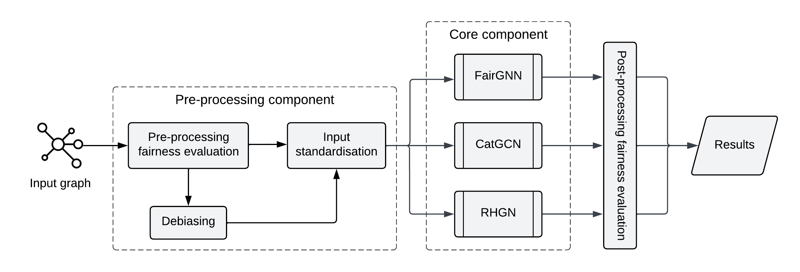

# FairUP: a Framework for Fairness Analysis of Graph Neural Network-Based User Profiling Models
*Mohamed Abdelrazek, Erasmo Purificato, Ludovico Boratto, and Ernesto William De Luca*

# Description
**FairUP** is a standardised framework that empowers researchers and practitioners to simultaneously analyse state-of-the-art Graph Neural Network-based models for user profiling task, in terms of classification performance and fairness metrics scores.

The framework, whose architecture is shown below, presents several components, which allow end-users to:
* compute the fairness of the input dataset by means of a pre-processing fairness metric, i.e. *disparate impact*;
* mitigate the unfairness of the dataset, if needed, by applying different debiasing methods, i.e. *sampling*, *reweighting* and *disparate impact remover*; 
* standardise the input (a graph in Neo4J or NetworkX format) for each of the included GNNs;
* train one or more GNN models, specifying the parameters for each of them;
* evaluate post-hoc fairness by exploiting four metrics, i.e. *statistical parity*, *equal opportunity*, *overall accuracy equality*, *treatment equality*.

